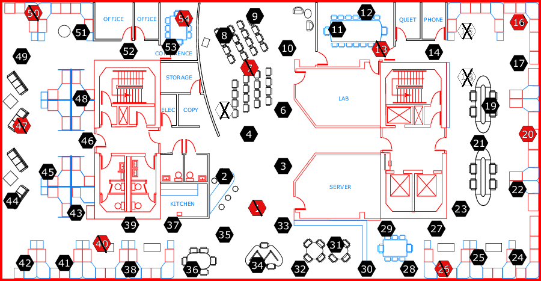
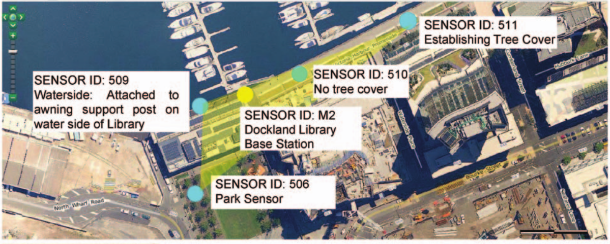

En la facultad de Ingeniería Eléctrica de la Universidad de Melbourne, el departamento de *Intelligent Sensors, Sensor Networks and Information Processing* (ISSNIP) tiene varias areas de investigación con las cuales mi tesis está relacionada:

- Internet de las cosas 
- Análisis de eventos en Big Data
- Monitoreo de Energía

Es por eso que durante las 3 primeras semanas dediqué mi tiempo a repasar las publicaciones anteriores de los investigadores del departamento que se relacionaban con estos temas para así poder definir una investigación conjunta.

Tras el intenso análisis, se decidió en una reunión conjunta del supervisor de mi estancia y otros dos investigadores que el tema del trabajo iba a ser "Imputación de datos faltantes en escenarios de Internet de las Cosas".

Con los avances en las capacidades de computación de los sensores a través de las emergentes tecnologías del Internet de las Cosas se están incrementando y facilitando el monitoreo de aplicaciones complejas. Para esas aplicaciones de IoT, la calidad de los datos espaciotemporales es de máxima importancia dado que estos datos influyen en la toma de decisiones que se llevan a cabo a tiempo real.

Algunos factores que afectan a la comunicación entre dispositivos causando datos faltantes son: pérdidas de comunicación, sensores imperfectos, batería limitada, ataques virtuales... etc. 

Los valores faltantes (*missing values* en inglés) influyen mucho en la calidad de los datos y por lo tanto para que un modelo sea de confianza y preciso se necesita poder estimar los valores faltantes de antemano. 

Los métodos actuales para imputar valores faltantes no consideran la incertidumbre en los datos procedentes de los sensores de baja calidad presentes en muchas redes. Para resolver el problema se ha propuesto el método *Bayesian Maximum Entropy (BME)* para estimar los valores faltantes.

BME es un método de estimación espaciontemporal que incorpora en sus cálculos los errores de medición de los sensores de baja precisión como intervalos junto con los datos procedentes de sensores de alta precisión.

Se ha estudiado la literatura correspondiente al problema en cuestión. Particularmente, el método *Probabilistic Matrix Factorization (PMF)* es el único anteriormente propuesto para resolver este problema. 

Además, se han analizado y tratado dos conjuntos de datos útiles para este problema: 

- El laboratorio de Intel Berkeley Research (ver Fig 1)

{width=300px}

- El conjunto de datos recogidos en el parque Docklands de Melbourne (ver Fig 2)

{width=300px}

Se han introducido artificialmente y de forma aleatoria los valores faltantes en los sensores de cada uno de estos escenarios y se han realizado los experimentos para estimar dichos valores. La comparación entre los métodos de estado del arte y el propuesto muestran la superioridad de nuestra propuesta.

Se está escribiendo un artículo para publicar los resultados en una revista de alto impacto.

